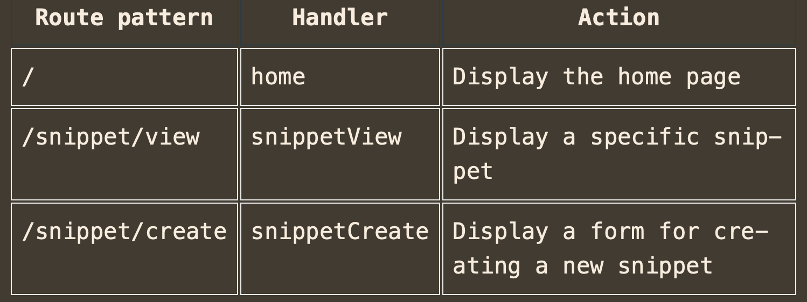

---

### Trailing slashes in route patterns

It’s important to know that Go’s servemux has different matching rules depending on whether a route pattern ends with a trailing slash or not.

- When a pattern doesn’t have a trailing slash, it will only be matched (and the corresponding handler called) when the request URL path exactly matches the pattern in full.
- When a route pattern ends with a trailing slash — like `"/"` or `"/static/"` — it is known as a subtree path pattern. Subtree path patterns are matched (and the corresponding handler called) whenever the start of a request URL path matches the subtree path. If it helps your understanding, you can think of subtree paths as acting a bit like they have a wildcard at the end, like `"/**"` or `"/static/**"`.

This helps explain why the `"/"` route pattern acts like a catch-all.

---
### Restricting subtree paths

To prevent subtree path patterns from acting like they have a wildcard at the end, you can append the special character sequence `{$}` to the end of the pattern  — like `"/{$}"` or `"/static/{$}`.

So if you have the route pattern `"/{$}"`, it effectively means match a single slash, followed by nothing else. It will only match requests where the URL path is exactly `/`.