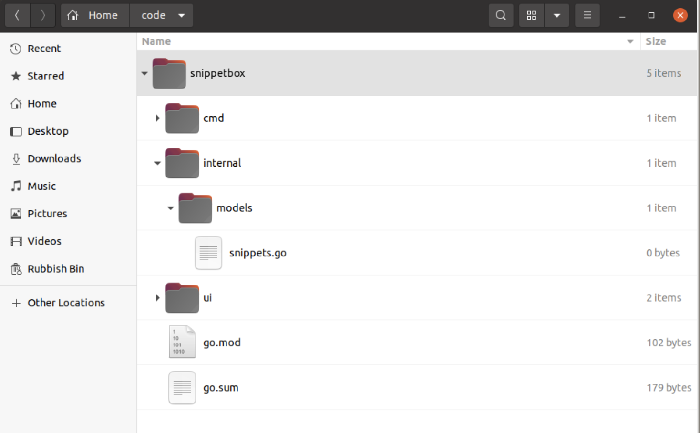

## 4.1 Setting up MySQL
The official MySQL documentation contains comprehensive [installation instructions](https://dev.mysql.com/doc/refman/8.0/en/installing.htmls) for all types of operating systems, but if you’re using Mac OS you should be able to install it with:
```
$ brew install mysql
```

Or if you’re using a Linux distribution which supports apt (like Debian and Ubuntu) you can install it with:
```
$ sudo apt install mysql-server
```

### Scaffolding the database
Once connected, the 1st thing we need to do is establish a database in MySQL to store all the data for our project. Copy and paste the following commands into the mysql prompt to create a new snippetbox database using UTF8 encoding.
```sql
-- Create a new UTF-8 `snippetbox` database.
CREATE DATABASE snippetbox CHARACTER SET utf8mb4 COLLATE utf8mb4_unicode_ci;

-- Switch to using the `snippetbox` database.
USE snippetbox;
```

Then copy and paste the following SQL statement to create a new snippets table to hold the text snippets for our application:
```sql
-- Create a `snippets` table.
CREATE TABLE snippets (
    id INTEGER NOT NULL PRIMARY KEY AUTO_INCREMENT,
    title VARCHAR(100) NOT NULL,
    content TEXT NOT NULL,
    created_at DATETIME NOT NULL,
    expires_at DATETIME NOT NULL
);

-- Add an index on the created_at column.
CREATE INDEX idx_snippets_created_at ON snippets(created_at);
```

Each record in this table will have an integer `id` field which will act as the unique identifier for the text snippet. It will also have a short text `title` and the snippet content itself will be stored in the `content` field. We’ll also keep some metadata about the times that the snippet was `created_at` and when it `expires_at`.

```sql
-- Add some dummy records.
INSERT INTO snippets (title, content, created_at, expires_at) VALUES (
    'An old silent pond',
    'An old silent pond...\nA frog jumps into the pond,\nsplash! Silence again.\n\n– Matsuo Bashō',
    UTC_TIMESTAMP(),
    DATE_ADD(UTC_TIMESTAMP(), INTERVAL 365 DAY)
);

INSERT INTO snippets (title, content, created_at, expires_at) VALUES (
    'Over the wintry forest',
    'Over the wintry\nforest, winds howl in rage\nwith no leaves to blow.\n\n– Natsume Soseki',
    UTC_TIMESTAMP(),
    DATE_ADD(UTC_TIMESTAMP(), INTERVAL 365 DAY)
);

INSERT INTO snippets (title, content, created_at, expires_at) VALUES (
    'First autumn morning',
    'First autumn morning\nthe mirror I stare into\nshows my father''s face.\n\n– Murakami Kijo',
    UTC_TIMESTAMP(),
    DATE_ADD(UTC_TIMESTAMP(), INTERVAL 7 DAY)
);
```

### Creating a new user
From a security point of view, it’s not a good idea to connect to MySQL as the root user from a web application. Instead it’s better to create a database user with restricted permissions on the database.

So, while you’re still connected to the MySQL prompt run the following commands to create a new web user with SELECT, INSERT, UPDATE and DELETE privileges only on the database.

```sql
CREATE USER 'web'@'localhost';
GRANT SELECT, INSERT, UPDATE, DELETE ON snippetbox.* TO 'web'@'localhost';
-- Important: Make sure to swap 'pass' with a password of your own choosing.
ALTER USER 'web'@'localhost' IDENTIFIED BY 'pass';
```

### Test the new user
You should now be able to connect to the snippetbox database as the web user using the following command. When prompted enter the password that you just set.
```
$ mysql -D snippetbox -u web -p
Enter password:
mysql>
```

If the permissions are working correctly you should find that you’re able to perform SELECT and INSERT operations on the database correctly, but other commands such as DROP TABLE and GRANT will fail.

```
mysql> SELECT id, title, expires_at FROM snippets;
+----+------------------------+---------------------+
| id | title                  | expires_at          |
+----+------------------------+---------------------+
|  1 | An old silent pond     | 2025-03-18 10:00:26 |
|  2 | Over the wintry forest | 2025-03-18 10:00:26 |
|  3 | First autumn morning   | 2024-03-25 10:00:26 |
+----+------------------------+---------------------+
3 rows in set (0.00 sec)
```
```
mysql> DROP TABLE snippets;
ERROR 1142 (42000): DROP command denied to user 'web'@'localhost' for table 'snippets'
```

---
## 4.2 Installing a database driver
To use MySQL from our Go web application we need to install a `database driver`. This essentially acts as a middleman, translating commands between Go and the MySQL database itself.

You can find a comprehensive [list of available drivers](https://go.dev/wiki/SQLDrivers) on the Go wiki, but for our application we’ll use the popular [go-sql-driver/mysql](https://github.com/go-sql-driver/mysql) driver.

---
## 4.3 Modules and reproducible builds
Now that the MySQL driver is installed, let’s take a look at the `go.mod` file. You should see a require block with two lines containing the path and exact version number of the packages that you downloaded:
```go
module snippetbox.t10i.net

go 1.22.4

require (
	filippo.io/edwards25519 v1.1.0 // indirect
	github.com/go-sql-driver/mysql v1.9.0 // indirect
)
```

These lines in `go.mod` essentially tell the Go command exactly which version of a package should be used when you run a command like `go run`, `go test` or `go build` from your project directory.

This makes it easy to have multiple projects on the same machine where different versions of the same package are used. For example, this project is using `v1.8.1` of the MySQL driver, but you could have another codebase on your computer which uses v1.5.0 and that would be A-OK.

> Note: The `// indirect` annotation indicates that a package doesn’t directly appear in any import statement in your codebase. Right now, we still haven’t written any code that actually uses either the `github.com/go-sql-driver/mysql` or `filippo.io/edwards25519` packages, which is why they are both marked as indirect dependencies. We’ll fix that in the next chapter.

You’ll also see that a new file has been created in the root of your project directory called `go.sum`.

This `go.sum` file contains the cryptographic checksums representing the content of the required packages.
```go
filippo.io/edwards25519 v1.1.0 h1:FNf4tywRC1HmFuKW5xopWpigGjJKiJSV0Cqo0cJWDaA=
filippo.io/edwards25519 v1.1.0/go.mod h1:BxyFTGdWcka3PhytdK4V28tE5sGfRvvvRV7EaN4VDT4=
github.com/go-sql-driver/mysql v1.9.0 h1:Y0zIbQXhQKmQgTp44Y1dp3wTXcn804QoTptLZT1vtvo=
github.com/go-sql-driver/mysql v1.9.0/go.mod h1:pDetrLJeA3oMujJuvXc8RJoasr589B6A9fwzD3QMrqw=
```
The `go.sum` file isn’t designed to be human-editable and generally you won’t need to open it. But it serves 2 useful functions:
- If you run the `go mod verify` command from your terminal, this will verify that the checksums of the downloaded packages on your machine match the entries in `go.sum`, so you can be confident that they haven’t been altered.
    ```
    $ go mod verify
    all modules verified
    ```
- If someone else needs to download all the dependencies for the project — which they can do by running go mod download — they will get an error if there is any mismatch between the packages they are downloading and the checksums in the file.

So, in summary:
- You (or someone else in the future) can run `go mod` download to download the exact versions of all the packages that your project needs.
- You can run `go mod verify` to ensure that nothing in those downloaded packages has been changed unexpectedly.
- Whenever you run `go run`, `go test` or `go build`, the exact package versions listed in `go.mod` will always be used.

And those things together makes it much easier to reliably create [reproducible builds](https://en.wikipedia.org/wiki/Reproducible_builds) of your Go applications.

### Upgrading packages
Once a package has been downloaded and added to your `go.mod` file the package and version are `‘fixed’`. But there are many reasons why you might want to upgrade to use a newer version of a package in the future.

To upgrade to latest available minor or patch release of a package, you can simply run go get with the `-u` flag like so:
```
$ go get -u github.com/foo/bar
```

Or alternatively, if you want to upgrade to a specific version then you should run the same command but with the appropriate @version suffix. For example:
```
$ go get -u github.com/foo/bar@v2.0.0
```

### Removing unused packages
Sometimes you might go get a package only to realize later that you don’t need it anymore. When this happens you’ve got two choices.

You could either run go get and postfix the package path with `@none`, like so:
```
$ go get github.com/foo/bar@none
```

Or if you’ve removed all references to the package in your code, you can run `go mod tidy`, which will automatically remove any unused packages from your go.mod and `go.sum` files.

---
## 4.4 Creating a database connection pool
Now that the MySQL database is all set up and we’ve got a driver installed, the natural next step is to connect to the database from our web application.

To do this we need Go’s [sql.Open()](https://pkg.go.dev/database/sql#Open) function, which you use a bit like this:
```go
// The sql.Open() function initializes a new sql.DB object, which is essentially a pool of database connections.
db, err := sql.Open("mysql", "web:pass@/snippetbox?parseTime=true")
    if err != nil {
        ...
}
```
- The 1st parameter to `sql.Open()` is the `driver name` and the 2nd parameter is the `data source name` (sometimes also called a `connection string` or `DSN`) which describes how to connect to your database.
- The format of the data source name will depend on which database and driver you’re using. Typically, you can find information and examples in the documentation for your specific driver. For the driver we’re using you can find that documentation [here](https://github.com/go-sql-driver/mysql#dsn-data-source-name).
- The `parseTime=true` part of the DSN above is a `driver-specific` parameter which instructs our driver to convert `SQL TIME` and `DATE` fields to Go `time.Time` objects.
- The `sql.Open()` function returns a [sql.DB](https://pkg.go.dev/database/sql#DB) object. This isn’t a database connection — it’s a `pool of many connections`. This is an important difference to understand. Go manages the connections in this pool as needed, automatically opening and closing connections to the database via the driver.
- The connection pool is safe for concurrent access, so you can use it from web application handlers safely.
- The connection pool is intended to be long-lived. In a web application it’s normal to initialize the connection pool in your `main()` function and then pass the pool to your handlers. You shouldn’t call `sql.Open()` in a short-lived HTTP handler itself — it would be a waste of memory and network resources.

There’re a few things about this code which are interesting:
- Notice how the import path for our driver is prefixed with an underscore? This is because our `main.go` file doesn’t actually use anything in the `mysql` package. So if we try to import it normally the Go compiler will raise an error. However, we need the driver’s `init()` function to run so that it can register itself with the `database/sql` package. The trick to getting around this is to alias the package name to the blank identifier, like we are here. This is standard practice for most of Go’s SQL drivers.
    ```go
    package main

    import (
        // ...
        _ "github.com/go-sql-driver/mysql"
    )
    ```
- The `sql.Open()` function doesn’t actually create any connections, all it does is initialize the pool for future use. Actual connections to the database are established lazily, as and when needed for the first time. So to verify that everything is set up correctly we need to use the [db.Ping()](https://pkg.go.dev/database/sql#DB.Ping) method to create a connection and check for any errors. If there is an error, we call [db.Close()](https://pkg.go.dev/database/sql#DB.Close) to close the connection pool and return the error.
- Going back to the `main()` function, at this moment in time the call to defer `db.Close()` is a bit superfluous. Our application is only ever terminated by a signal interrupt (i.e. `Ctrl+C`) or by `os.Exit(1)`. In both of those cases, the program exits immediately and deferred functions are never run. But making sure to always close the connection pool is a good habit to get into, and it could be beneficial in the future if you add a graceful shutdown to your application.

---
## 4.5 Designing a Database Model
In this chapter we’re going to sketch out a database model for our project.

If you don’t like the term `model`, you might want to think of it as a `service layer` or `data access layer` instead. Whatever you prefer to call it, the idea is that we will encapsulate the code for working with MySQL in a separate package to the rest of our application.



> Remember: The internal directory is being used to hold ancillary non-application-specific code, which could potentially be reused. A database model which could be used by other applications in the future (like a command line interface application) fits the bill here.

### Benefits of this structure
- There’s a clean separation of concerns. Our database logic won’t be tied to our handlers, which means that handler responsibilities are limited to HTTP stuff (i.e. validating requests and writing responses). This will make it easier to write tight, focused, unit tests in the future.
- By creating a custom SnippetModel type and implementing methods on it we’ve been able to make our model a single, neatly encapsulated object, which we can easily initialize and then pass to our handlers as a dependency. Again, this makes for easier to maintain, testable code.
- Because the model actions are defined as methods on an object — in our case SnippetModel — there’s the opportunity to create an interface and mock it for unit testing purposes.
- And finally, we have total control over which database is used at runtime, just by using the `-dsn` command-line flag.

---
## 4.6 Executing SQL statements
Now let’s update the `SnippetModel.Insert()` method — which we’ve just made — so that it creates a new record in our snippets table and then returns the integer id for the new record.

To do this we’ll want to execute the following SQL query on our database:
```sql
INSERT INTO snippets (title, content, created_at, expires_at)
VALUES(?, ?, UTC_TIMESTAMP(), DATE_ADD(UTC_TIMESTAMP(), INTERVAL ? DAY))
```

Notice how in this query we’re using the `?` character to indicate placeholder parameters for the data that we want to insert in the database? Because the data we’ll be using will ultimately be untrusted user input from a form, it’s good practice to use placeholder parameters instead of interpolating data in the SQL query.

### Executing the query
Go provides 3 different methods for executing database queries:
- [DB.Query()](https://pkg.go.dev/database/sql#DB.Query) is used for SELECT queries which return multiple rows.
- [DB.QueryRow()](https://pkg.go.dev/database/sql#DB.QueryRow) is used for SELECT queries which return a single row.
- [DB.Exec()](https://pkg.go.dev/database/sql#DB.Exec) is used for statements which don’t return rows (like INSERT and DELETE).

The [sql.Result](https://pkg.go.dev/database/sql#Result) type returned by `DB.Exec()`. This provides 2 methods:
- `LastInsertId()` — which returns the integer (an int64) generated by the database in response to a command. Typically this will be from an `auto increment` column when inserting a new row, which is exactly what’s happening in our case.
- `RowsAffected()` — which returns the number of rows (as an int64) affected by the statement.

> Important: Not all drivers and databases support the `LastInsertId()` and `RowsAffected()` methods. For example, `LastInsertId()` is not supported by PostgreSQL. So if you’re planning on using these methods it’s important to check the documentation for your particular driver first.

### Placeholder parameters
In the code above we constructed our SQL statement using placeholder parameters, where `?` acted as a placeholder for the data we want to insert.

The reason for using `placeholder parameters` to construct our query (rather than string interpolation) is to help avoid `SQL injection` attacks from any untrusted user-provided input.

Behind the scenes, the `DB.Exec()` method works in 3 steps:
1. It creates a new [prepared statement](https://en.wikipedia.org/wiki/Prepared_statement) on the database using the provided SQL statement. The database parses and compiles the statement, then stores it ready for execution.
2. In a second separate step, `DB.Exec()` passes the parameter values to the database. The database then executes the prepared statement using these parameters. Because the parameters are transmitted later, after the statement has been compiled, the database treats them as pure data. They can’t change the intent of the statement. So long as the original statement is not derived from untrusted data, injection cannot occur.
3. It then closes (or `deallocates`) the prepared statement on the database.

> The placeholder parameter syntax differs depending on your database. MySQL, SQL Server and SQLite use the `?` notation, but PostgreSQL uses the `$N` notation. For example, if you were using PostgreSQL instead you would write:
```go
_, err := m.DB.Exec("INSERT INTO ... VALUES ($1, $2, $3)", ..
```

---
## 4.7 Single-record SQL queries
Behind the scenes of `rows.Scan()` your driver will automatically convert the raw output from the SQL database to the required native Go types. So long as you’re sensible with the types that you’re mapping between SQL and Go, these conversions should generally Just Work. Usually:
- CHAR, VARCHAR and TEXT map to string.
- BOOLEAN maps to bool.
- INT maps to int; BIGINT maps to int64.
- DECIMAL and NUMERIC map to float.
- TIME, DATE and TIMESTAMP map to time.Time.

As an aside, you might be wondering why we’re returning the `ErrNoRecord` error from our `SnippetModel.Get()` method, instead of `sql.ErrNoRows` directly. The reason is to help encapsulate the model completely, so that our handlers aren’t concerned with the underlying datastore or reliant on datastore-specific errors (like `sql.ErrNoRows`) for its behavior.