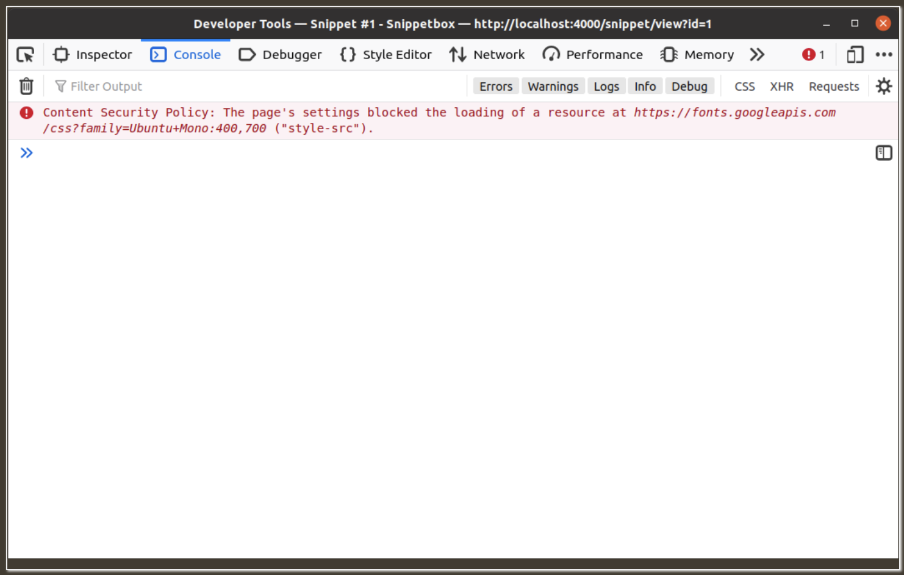

When you’re building a web application there’s probably some shared functionality that you want to use for many (or even all) HTTP requests. For example, you might want to log every request, compress every response, or check a cache before passing the request to your handlers.

A common way of organizing this shared functionality is to set it up as middleware. This is essentially some self-contained code which independently acts on a request before or after your normal application handlers.

---
## 6.1 How middleware works
> You can think of a Go web application as a chain of `ServeHTTP()` methods being called one after another.

Currently, in our application, when our server receives a new HTTP request it calls the servemux’s `ServeHTTP()` method. This looks up the relevant handler based on the request method and URL path, and in turn calls that handler’s `ServeHTTP()` method.

The basic idea of middleware is to insert another handler into this chain. The middleware handler executes some logic, like logging a request, and then calls the `ServeHTTP()` method of the next handler in the chain.

In fact, we’re actually already using some middleware in our application — the `http.StripPrefix()` function from serving static files, which removes a specific prefix from the request’s URL path before passing the request on to the file server.

### The pattern
The standard pattern for creating your own middleware looks like this:
```go
func myMiddleware(next http.Handler) http.Handler {
    fn := func(w http.ResponseWriter, r *http.Request) {
        // TODO: Execute our middleware logic here...
        next.ServeHTTP(w, r)
    }

    return http.HandlerFunc(fn)
}
```

- The `myMiddleware()` function is essentially a wrapper around the next handler, which we pass to it as a parameter.
- It establishes a function fn which closes over the next handler to form a closure. When fn is run it executes our middleware logic and then transfers control to the next handler by calling it’s `ServeHTTP()` method.
- Regardless of what you do with a closure it will always be able to access the variables that are local to the scope it was created in — which in this case means that fn will always have access to the next variable.
- In the final line of code, we then convert this closure to a `http.Handler` and return it using the `http.HandlerFunc()` adapter.

If this feels confusing, you can think of it more simply: `myMiddleware()` is a function that accepts the next handler in a chain as a parameter. It returns a handler which executes some logic and then calls the next handler.

### Simplifying the middleware
A tweak to this pattern is to use an anonymous function inside `myMiddleware()` middleware:
```go   
func myMiddleware(next http.Handler) http.Handler {
    return http.HandlerFunc(func(w http.ResponseWriter, r *http.Request) {
        // TODO: Execute our middleware logic here...
        next.ServeHTTP(w, r)
    })
}
```
This pattern is very common in the wild, and the one that you’ll probably see most often if you’re reading the source code of other applications or third-party packages.

### Positioning the middleware
It’s important to explain that where you position the middleware in the chain of handlers will affect the behavior of your application.

If you position your middleware before the `servemux` in the chain then it will act on every request that your application receives.
```
myMiddleware → servemux → application handler
```

A good example of where this would be useful is middleware to log requests — as that’s typically something you would want to do for all requests.

Alternatively, you can position the middleware after the `servemux` in the chain — by wrapping a specific application handler. This would cause your middleware to only be executed for a specific route.
```
servemux → myMiddleware → application handler
```

An example of this would be something like authorization middleware, which you may only want to run on specific routes.

---
## 6.2 Setting common headers
Let’s put the pattern we learned in the previous chapter to use, and make some middleware which automatically adds our Server: Go header to every response, along with the following HTTP security headers (inline with current [OWASP guidance](https://owasp.org/www-project-secure-headers/)).

```
Content-Security-Policy: default-src 'self'; style-src 'self' fonts.googleapis.com; font-src fonts.gstatic.com
Referrer-Policy: origin-when-cross-origin
X-Content-Type-Options: nosniff
X-Frame-Options: deny
X-XSS-Protection: 0
```
- `Content-Security-Policy` (often abbreviated to `CSP`) headers are used to restrict where the resources for your web page (e.g. JavaScript, images, fonts etc) can be loaded from. Setting a strict [CSP](https://developer.mozilla.org/en-US/docs/Web/HTTP/CSP) policy helps prevent a variety of cross-site scripting, clickjacking, and other code-injection attacks.

    CSP headers and how they work is a big topic, and I recommend reading [this primer](https://developer.mozilla.org/en-US/docs/Web/HTTP/CSP) if you haven’t come across them before. But, in our case, the header tells the browser that it’s OK to load fonts from `fonts.gstatic.com`, stylesheets from `fonts.googleapis.com` and `self` (our own origin), and then `everything else` only from `self`. Inline JavaScript is blocked by default.
- `Referrer-Policy` is used to control what information is included in a `Referer` header when a user navigates away from your web page. In our case, we’ll set the value to `origin-when-cross-origin`, which means that the full URL will be included for [same-origin requests](https://developer.mozilla.org/en-US/docs/Web/Security/Same-origin_policy), but for all other requests information like the URL path and any query string values will be stripped out.
- `X-Content-Type-Options: nosniff` instructs browsers to not MIME-type sniff the content-type of the response, which in turn helps to prevent [content-sniffing attacks](https://security.stackexchange.com/questions/7506/using-file-extension-and-mime-type-as-output-by-file-i-b-combination-to-dete/7531#7531).
- `X-Frame-Options: deny` is used to help prevent [click-jacking ](https://developer.mozilla.org/en-US/docs/Web/Security/Types_of_attacks#click-jacking) attacks in older browsers that don’t support CSP headers.
- `X-XSS-Protection: 0` is used to disable the blocking of cross-site scripting attacks. Previously it was good practice to set this header to `X-XSS-Protection: 1; mode=block`, but when you’re using CSP headers like we are the [recommendation](https://owasp.org/www-project-secure-headers/#x-xss-protection) is to disable this feature altogether.

### Flow of control
It’s important to know that when the last handler in the chain returns, control is passed back up the chain in the reverse direction. So when our code is being executed the flow of control actually looks like this:
```
commonHeaders → servemux → application handler → servemux → commonHeaders
```

In any middleware handler, code which comes before `next.ServeHTTP()` will be executed on the way down the chain, and any code after `next.ServeHTTP()` — or in a deferred function — will be executed on the way back up.
```go
func myMiddleware(next http.Handler) http.Handler {
    return http.HandlerFunc(func(w http.ResponseWriter, r *http.Request) {
        // Any code here will execute on the way down the chain.
        next.ServeHTTP(w, r)
        // Any code here will execute on the way back up the chain.
    })
}
```

### Early returns
Another thing to mention is that if you call return in your middleware function before you call `next.ServeHTTP()`, then the chain will stop being executed and control will flow back upstream.

As an example, a common use-case for early returns is authentication middleware which only allows execution of the chain to continue if a particular check is passed. For instance:

```go
func myMiddleware(next http.Handler) http.Handler {
    return http.HandlerFunc(func(w http.ResponseWriter, r *http.Request) {
        // If the user isn't authorized, send a 403 Forbidden status and
        // return to stop executing the chain.
        if !isAuthorized(r) {
            w.WriteHeader(http.StatusForbidden)
            return
        }

        // Otherwise, call the next handler in the chain.
        next.ServeHTTP(w, r)
    })
}
```

### Debugging CSP issues
While CSP headers are great and you should definitely use them, it’s worth saying that I’ve spent many hours trying to debug problems, only to eventually realize that a critical resource or script is being “blocked by my own CSP rules 🤦.

If you’re working on a project which is using CSP headers, like this one, I recommend keeping your web browser developer tools handy and getting into the habit of checking the logs early on if you run into any unexpected problems. In Firefox, any blocked resources will be shown as an error in the console logs — similar to this:


## 6.3 Panic recovery
In a simple Go application, when your code panics it will result in the application being terminated straight away.

But our web application is a bit more sophisticated. Go’s HTTP server assumes that the effect of any panic is isolated to the goroutine serving the active HTTP request (remember, every request is handled in it’s own goroutine).

Specifically, following a panic our server will log a stack trace to the server error log, unwind the stack for the affected goroutine (calling any deferred functions along the way) and close the underlying HTTP connection. But it won’t terminate the application, so importantly, any panic in your handlers won’t bring down your server.

### Panic recovery in background goroutines
It’s important to realize that our middleware will only recover panics that happen in the same goroutine that executed the `recoverPanic()` middleware.

If, for example, you have a handler which spins up another goroutine (e.g. to do some background processing), then any panics that happen in the second goroutine will not be recovered — not by the `recoverPanic()` middleware… and not by the panic recovery built into Go HTTP server. They will cause your application to exit and bring down the server.

So, if you are spinning up additional goroutines from within your web application and there is any chance of a panic, you must make sure that you recover any panics from within those too. For example:

```go
func (app *application) myHandler(w http.ResponseWriter, r *http.Request) {
    ...
    // Spin up a new goroutine to do some background processing.
    go func() {
        defer func() {
            if err := recover(); err != nil {
                app.logger.Error(fmt.Sprint(err))
            }
        }()

        doSomeBackgroundProcessing()
    }()

    w.Write([]byte("OK"))
}
```

## 6.4 Composable middleware chains
Introduce the [justinas/alice](https://github.com/justinas/alice) package to help us manage our middleware/handler chains.

You don’t need to use this package, but the reason I recommend it is because it makes it easy to create composable, reusable, middleware chains — and that can be a real help as your application grows and your routes become more complex. The package itself is also small and lightweight, and the code is clear and well written.

To demonstrate its features in one example, it allows you to rewrite a handler chain from this:
```go
return myMiddleware1(myMiddleware2(myMiddleware3(myHandler)))
```

Into this, which is a bit clearer to understand at a glance:
```go
return alice.New(myMiddleware1, myMiddleware2, myMiddleware3).Then(myHandler)
```

But the real power lies in the fact that you can use it to create middleware chains that can be assigned to variables, appended to, and reused. For example:
```go
myChain := alice.New(myMiddlewareOne, myMiddlewareTwo)
myOtherChain := myChain.Append(myMiddleware3)
return myOtherChain.Then(myHandler)
```
