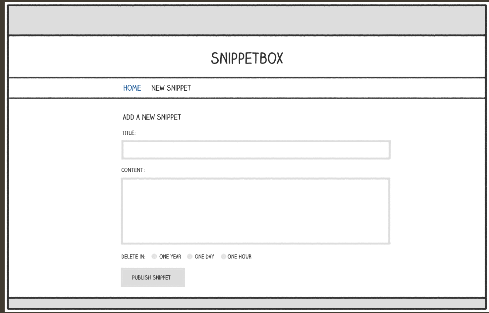
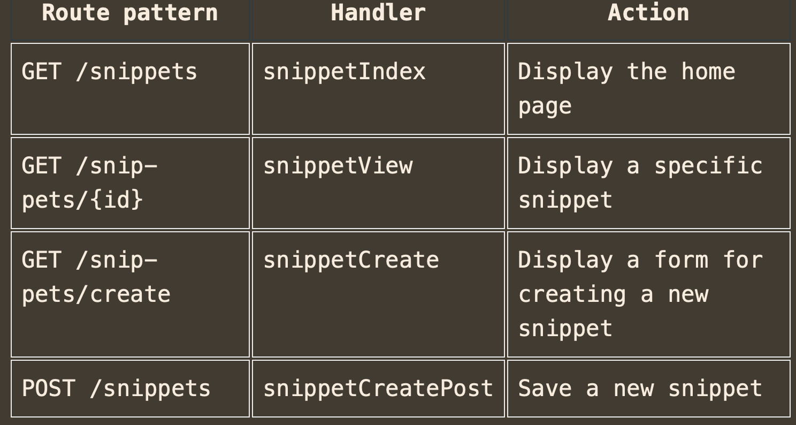

In this section, we’re going to focus on adding an HTML form for creating new snippets. The form will look a bit like this:


The high-level flow for processing this form will follow a standard `Post-Redirect-Get` pattern and will work like so:
- The user is shown the blank form when they make a `GET` request to `/snippet/create`.
- The user completes the form and it’s submitted to the server via a `POST` request to `/snippet/create`.
- The form data will be validated by our `snippetCreatePost` handler. If there are any validation failures the form will be re-displayed with the appropriate form fields highlighted. If it passes our validation checks, the data for the new snippet will be added to the database and then we’ll redirect the user to `GET` `/snippet/view/{id}`.

### The PostFormValue method
The net/http package also provides the [r.PostFormValue()](https://pkg.go.dev/net/http#Request.PostFormValue) method, which is essentially a shortcut function that calls `r.ParseForm()` for you and then fetches the appropriate field value from `r.PostForm`.

I recommend avoiding this shortcut because it silently ignores any errors returned by `r.ParseForm()`. If you use it, it means that the parsing step could be encountering errors and failing for users, but there’s no feedback mechanism to let them (or you) know about the problem.

### Multiple-value fields
Strictly speaking, the `r.PostForm.Get()` method that we’ve used only returns the `first` value for a specific form field. This means you can’t use it with form fields which potentially send multiple values, such as a group of checkboxes.

```html
<input type="checkbox" name="items" value="foo"> Foo
<input type="checkbox" name="items" value="bar"> Bar
<input type="checkbox" name="items" value="baz"> Baz
```
In this case you’ll need to work with the `r.PostForm` map directly. The underlying type of the `r.PostForm` map is [url.Values](https://pkg.go.dev/net/url#Values), which in turn has the underlying type `map[string][]string`. So, for fields with multiple values you can loop over the underlying map to access them like so:

```go
for i, item := range r.PostForm["items"] {
    fmt.Fprintf(w, "%d: Item %s\n", i, item)
}
```

### Limiting form size
By default, forms submitted with a POST method have a size limit of 10MB of data. The exception to this is if your form has the `enctype="multipart/form-data"` attribute and is sending multipart data, in which case there is no default limit.

If you want to change the 10MB limit, you can use the [http.MaxBytesReader()](https://pkg.go.dev/net/http#MaxBytesReader) function like so:

```go
// Limit the request body size to 4096 bytes
r.Body = http.MaxBytesReader(w, r.Body, 4096)

err := r.ParseForm()
if err != nil {
    http.Error(w, "Bad Request", http.StatusBadRequest)
    return
}
```

With this code only the first 4096 bytes of the request body will be read during `r.ParseForm()`. Trying to read beyond this limit will cause the MaxBytesReader to return an error, which will subsequently be surfaced by `r.ParseForm()`.

Additionally — if the limit is hit — MaxBytesReader sets a flag on `http.ResponseWriter` which instructs the server to close the underlying TCP connection.

### Query string parameters
If you have a form that submits data using the HTTP method GET, rather than POST, the form data will be included as `URL query string parameters`. For example, if you have a HTML form that looks like this:
```go
<form action='/foo/bar' method='GET'>
    <input type='text' name='title'>
    <input type='text' name='content'>
    
    <input type='submit' value='Submit'>
</form>
```

When the form is submitted, it will send a GET request with a URL that looks like this: `/foo/bar?title=value&content=value`.

You can retrieve the values for the query string parameters in your handlers via the `r.URL.Query().Get()` method. This will always return a string value for a parameter, or the empty string `""` if no matching parameter exists. For example:

```go
func exampleHandler(w http.ResponseWriter, r *http.Request) {
    title := r.URL.Query().Get("title")
    content := r.URL.Query().Get("content")

    ...
}
```

### The r.Form map
An alternative way to access query string parameters is via the `r.Form` map. This is similar to the `r.PostForm` map that we’ve used in this chapter, except that it contains the form data from any POST request body and any query string parameters.

Let’s say that you have some code in your handler that looks like this:
```go
err := r.ParseForm()
if err != nil {
    http.Error(w, "Bad Request", http.StatusBadRequest)
    return
}

title := r.Form.Get("title")
```

In this code, the line r.Form.Get("title") will return the title value from the POST request body or from a query string parameter with the name title. In the event of a conflict, the request body value will take precedent over the query string parameter.

Using r.Form can be very helpful if you want your application to be agnostic about how data values are passed to it. But outside of that scenario, r.Form doesn’t offer any benefits and it is clearer and more explicit to read data from the POST request body via r.PostForm or from query string parameters via `r.URL.Query().Get()`.

### Restful routing
If you’ve got a background in Ruby-on-Rails, Laravel or similar, you might be wondering why we haven’t structured our routes and handlers to be more ‘RESTful’ and look like this:



The first reason is because of overlapping routes — a HTTP request to `/snippets/create` potentially matches both the `GET /snippets/{id}` and `GET /snippets/create` routes. In our application, the snippet ID values are always numeric so there will never be a ‘real’ overlap between these two routes — but imagine if our snippet ID values were user-generated, or a random 6-character string, and hopefully you can see the potential for a problem. Generally speaking, overlapping routes can be a source of bugs and unexpected behavior in your application, and it’s good practice to avoid them if you can — or use them with care and caution if you can’t.

The second reason is that the HTML form presented on `/snippets/create` would need to post to `/snippets` when submitted. This means that when we re-render the HTML form to show any validation errors, the URL in the user’s browser will also change to `/snippets`. YMMV on whether you consider this a problem or not — most users don’t look at URLs, but I think it’s a bit clunky and confusing in terms of “UX… especially if a GET request to /snippets normally renders something else (like a list of all snippets).

### Generics
Go 1.18 was the first version of the language to support generics — also known by the more technical name of `parametric polymorphism`. Very broadly, generics allow you to write code that works with `different concrete types`.

For example, in older versions of Go, if you wanted to count how many times a particular value appears in a `[]string slice` and an `[]int slice` you would need to write two separate functions — one function for the `[]string` type and another for the `[]int`.

```go
// Count how many times the value v appears in the slice s.
func countString(v string, s []string) int {
    count := 0
    for _, vs := range s {
        if v == vs {
            count++
        }
    }
    return count
}

func countInt(v int, s []int) int {
    count := 0
    for _, vs := range s {
        if v == vs {
            count++
        }
    }
    return count
}
```

Now, with generics, it’s possible to write a single `count()` function that will work for []string, []int, or any other slice of a [comparable type](https://pkg.go.dev/builtin#comparable).
```go
func count[T comparable](v T, s []T) int {
    count := 0
    for _, vs := range s {
        if v == vs {
            count++
        }
    }
    return count
}
```

You don’t need to use generics, and it’s OK not to.

But even with those caveats, writing generic code can be really useful in certain scenarios. Very generally speaking, you might want to consider it:
- If you find yourself writing repeated boilerplate code for different data types. Examples of this might be common operations on slices, maps or channels — or helpers for carrying out validation checks or test assertions on different data types.
- When you are writing code and find yourself reaching for the any (empty interface{}) type. An example of this might be when you are creating a data structure (like a queue, cache or linked list) which needs to operate on different types.

In contrast, you probably don’t want to use generics:
- If it makes your code harder to understand or less clear.
- If all the types that you need to work with have a common set of methods — in which case it’s better to define and use a normal interface type instead.
- Just because you can. Prefer instead write non-generic code by default, and switch to a generic version later only if it is actually needed.